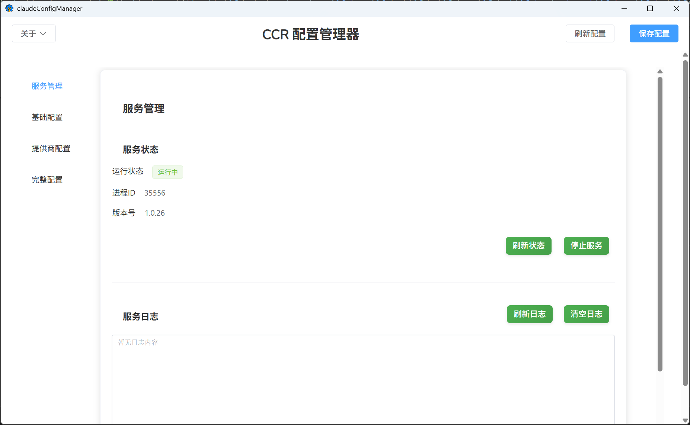
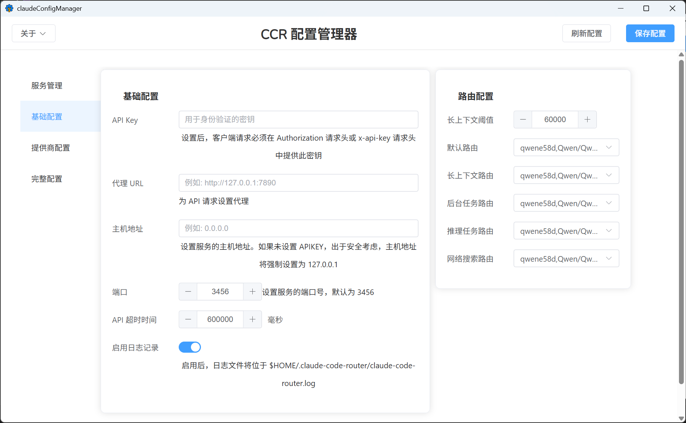
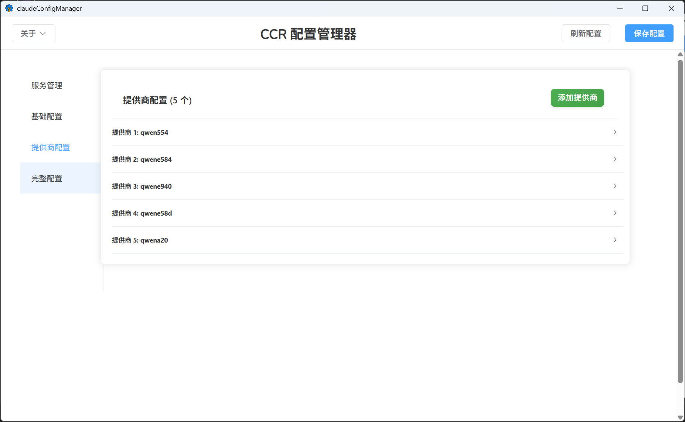

# CCR 配置管理器

CCR 配置管理器是一个用于管理和配置 Claude Code Router (CCR) 的图形化配置管理工具。该工具提供了直观的用户界面，方便用户配置和管理 CCR 的各种设置。



## 主要功能

- **服务管理**：启动、停止和重启 CCR 服务，查看服务状态和日志
- **基础配置**：设置 API 密钥、代理、主机地址、端口等核心参数
- **提供商配置**：添加、编辑和删除 AI 服务提供商及其模型
- **路由配置**：配置不同类型任务的默认路由，包括后台任务、推理任务、长上下文任务和网络搜索任务
- **实时预览**：实时查看配置文件的完整 JSON 格式
- **一键保存**：将配置保存到 CCR 配置文件中



## 使用方法

### 启动应用

运行以下命令启动开发模式：
```bash
wails dev
```

或者使用构建好的可执行文件启动应用。

### 导航界面

应用启动后，界面分为三个主要区域：

1. **顶部菜单**提供应用操作：
   - **关于**：点击跳转到 GitHub 项目页面
   - **刷新配置**：重新加载配置文件
   - **保存配置**：保存当前配置到文件

2. **左侧菜单**提供四个功能模块：
   - **服务管理**：启动、停止和重启 CCR 服务，查看服务状态和日志
   - **基础配置**：设置 API 密钥、代理、主机地址等核心参数
   - **提供商配置**：添加和管理 AI 服务提供商及其模型
   - **完整配置**：以 JSON 格式查看和编辑完整配置

3. **主内容区**显示当前选中的功能模块内容



### 服务管理

在服务管理页面，您可以：
- 查看 CCR 服务的运行状态和进程 ID
- 启动、停止或重启 CCR 服务
- 查看服务日志并清空日志

### 配置管理

在基础配置页面，您可以设置：
- **API Key**：用于身份验证的密钥
- **代理 URL**：为 API 请求设置代理
- **主机地址**：设置服务的主机地址
- **端口**：设置服务的端口号
- **API 超时时间**：设置 API 请求的超时时间
- **启用日志记录**：启用或禁用日志记录功能

在路由配置区域，您可以设置不同类型任务的默认路由：
- **长上下文阈值**：设置长上下文任务的字符阈值
- **默认路由**：设置默认任务的路由
- **长上下文路由**：设置长上下文任务的路由
- **后台任务路由**：设置后台任务的路由
- **推理任务路由**：设置推理任务的路由
- **网络搜索路由**：设置网络搜索任务的路由

### 提供商配置

在提供商配置页面，您可以：
- 添加新的 AI 服务提供商
- 编辑现有提供商的配置信息
- 删除不需要的提供商
- 为每个提供商设置：
  - 提供商名称
  - API 基础 URL
  - API 密钥
  - 模型列表
  - 转换器配置

### 保存配置

在完成配置编辑后，点击右上角的"保存配置"按钮将配置保存到 `~/.claude-code-router/config.json` 文件中。

## 构建应用

### 开发模式

```bash
wails dev
```

### 生产构建

```bash
wails build
```

## 项目结构

```
├── app.go                  # Go 后端代码
├── main.go                 # 应用入口点
├── frontend/               # 前端代码
│   ├── src/                # Vue 组件
│   │   ├── App.vue         # 主应用组件
│   │   └── components/     # 其他组件
│   └── wailsjs/            # Wails 生成的绑定代码
├── build/                  # 构建输出目录
└── README.md              # 项目说明文档
```

## 依赖

- Go 1.19+
- Node.js 16+
- Wails v2

## CCR 项目地址

[https://github.com/alexrider203/claud-code-router](https://github.com/alexrider203/claud-code-router)

## 本项目地址

[https://github.com/ayuayue/ccr-config-manager](https://github.com/ayuayue/ccr-config-manager)